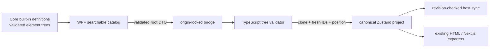

# ADR-0001: Keep built-in component definitions in Core and instantiate them in the editor

## Status

Accepted — 2026-08-20

## Requirements

- Provide searchable, reusable first-party blocks without changing the persisted Project schema.
- Insert a complete nested tree as one editor mutation and select the new root.
- Guarantee fresh project-wide element IDs on every insertion.
- Preserve the existing host-owned revision/conflict protocol, undo-ready mutation boundary,
  Project validation, and exporter compatibility.
- Keep templates deterministic, asset-independent, fast to enumerate, and safe at both sides of
  the WebView2 bridge. The initial catalog is small; no plug-in runtime is justified yet.

## Architecture

## Decision

Store immutable-in-practice, compiled component definitions in `WebsiteBuilder.Core`. Validate
each definition with the same content policy as a Project. The WPF panel owns discovery and
sends only a definition's root tree through a dedicated `editor.insertComponent` event. The
editor validates the subtree again, deep-clones it, replaces every ID, positions its root, and
commits it through one store mutation. A component instance then becomes ordinary project
elements; exporters and persistence need no component-specific branches.

## Consequences

### Positive

- One canonical component catalog with no C#/TypeScript template duplication.
- Inserted designs stay editable and portable because no live template reference is persisted.
- Existing validation, rendering, responsive styling, and code generation are reused.
- A whole block is one revision, which gives Phase 15 a clean undo/redo unit.

### Negative

- Updating a built-in definition does not update already-inserted instances.
- Compiled templates require an application release to change.
- Asset-dependent marketplace templates need a future signed package/import design.

### Neutral

- The existing in-canvas palette remains the primitive-element palette; the WPF Components
  panel is the first-party block browser.

## Alternatives Considered

- Persist live component-instance references: rejected because overrides, schema migration, and
  exporter resolution would add substantial complexity before reusable instances are required.
- Duplicate definitions in C# and TypeScript: rejected because catalogs would drift.
- Load arbitrary JSON templates from disk: deferred because trust, signing, asset import, and
  version compatibility require a separate package boundary.

## Failure modes and mitigations

- Malformed/unsafe compiled definition: startup validation fails deterministically; tests cover
  unsafe attributes and unique IDs.
- Spoofed bridge payload: TypeScript validates shape, depth, count, IDs, styles/attributes, and
  rejects managed-asset references before mutation.
- ID collision: every node is assigned a new ID in the editor before insertion.
- Large catalog UI cost: definitions are metadata-only until inserted; later grid virtualization
  belongs to Phase 16 if measured catalog size requires it.
